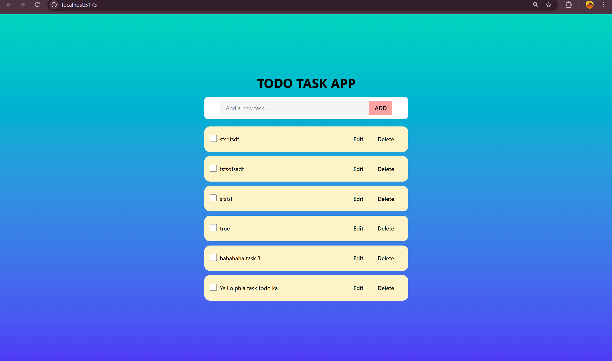
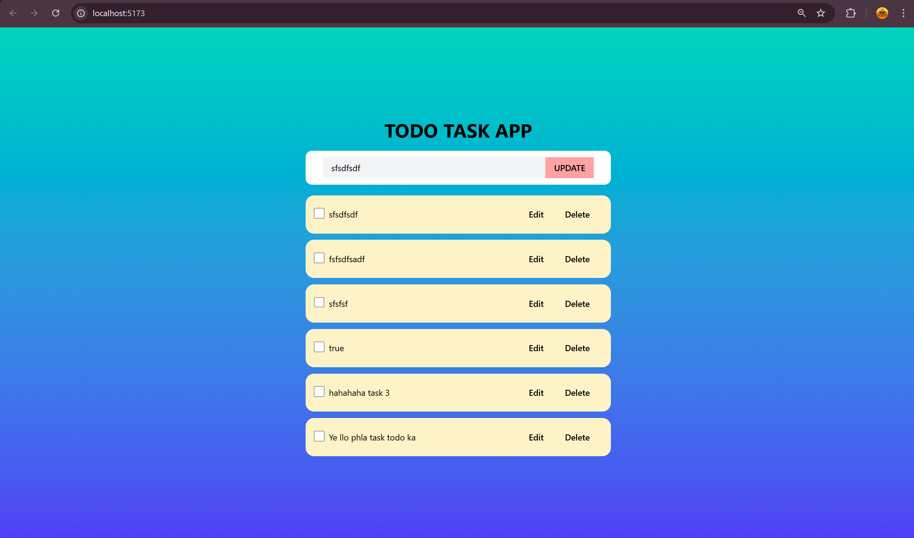
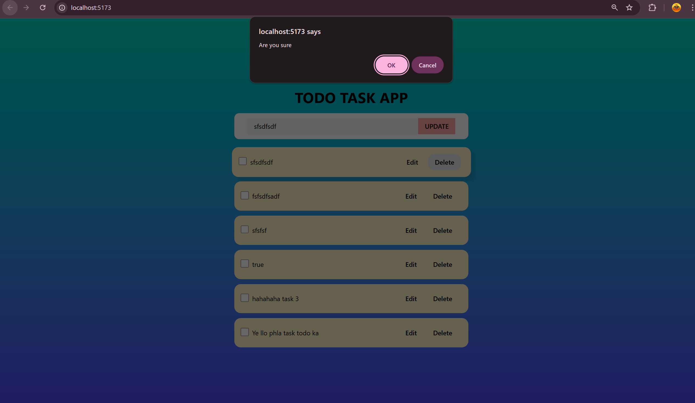
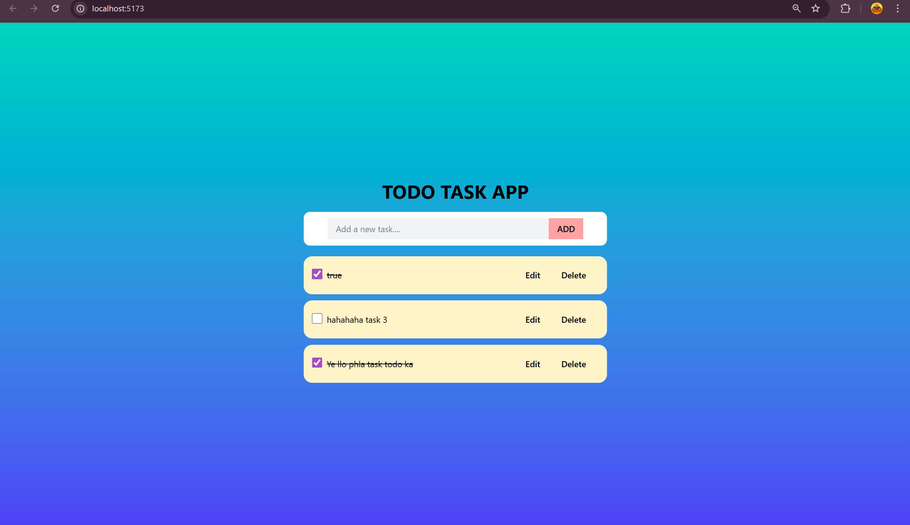
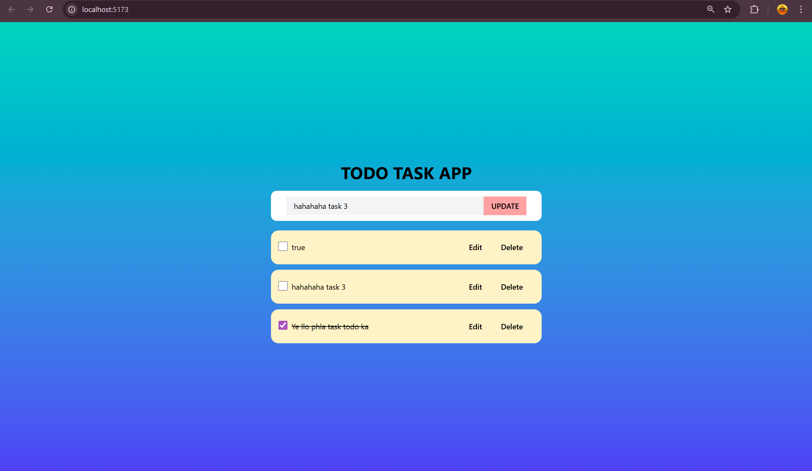

      
    </a>
  <h3 align="center">Home </h3>

      
    </a>
  <h3 align="center">Edit </h3>

      
    </a>
  <h3 align="center">Delete </h3>

      
    </a>
  <h3 align="center">Complete Strike </h3>

      
    </a>
  <h3 align="center">Update </h3>

##    <a name="introduction">✨ Introduction</a>

Todo App: Where user can create/update/edit/delete (CRUD) there todo.

##   <a name="quick-start">🚀 Quick Start</a>

Follow these steps to set up the project locally on your machine.

 **To Run: **

1. Clone the repository or download zip file.
2. Extract it. 
3. Download the necessary modules used to run this project. Independently for backend and for fronent. Just simplu run command npm i. It automatically run and download all the needed packages.

